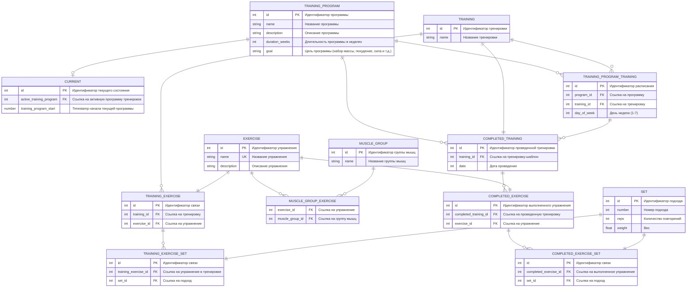

```mermaid
erDiagram
    TRAINING {
        int id PK "Идентификатор тренировки"
        string name "Название тренировки"
    }

    EXERCISE {
        int id PK "Идентификатор упражнения"
        string name UK "Название упражнения"
        string description "Описание упражнения"
    }

    MUSCLE_GROUP {
        int id PK "Идентификатор группы мышц"
        string name "Название группы мышц"
    }

    TRAINING_EXERCISE {
        int id PK "Идентификатор связи"
        int training_id FK "Ссылка на тренировку"
        int exercise_id FK "Ссылка на упражнение"
    }

    MUSCLE_GROUP_EXERCISE {
        int exercise_id FK "Ссылка на упражнение"
        int muscle_group_id FK "Ссылка на группу мышц"
    }

    TRAINING_PROGRAM {
        int id PK "Идентификатор программы"
        string name "Название программы"
        string description "Описание программы"
        int duration_weeks "Длительность программы в неделях"
        string goal "Цель программы (набор массы, похудение, сила и т.д.)"
    }

    CURRENT {
        int id PK "Идентификатор текущего состояния"
        int active_training_program FK "Ссылка на активную программу тренировок"
        number training_program_start "Timestamp начала текущей программы"
    }

    TRAINING_PROGRAM_TRAINING {
        int id PK "Идентификатор расписания"
        int program_id FK "Ссылка на программу"
        int training_id FK "Ссылка на тренировку"
        int day_of_week "День недели (1-7)"
    }

    COMPLETED_TRAINING {
        int id PK "Идентификатор проведенной тренировки"
        int training_id FK "Ссылка на тренировку-шаблон"
        int date "Дата проведения"
    }

    COMPLETED_EXERCISE {
        int id PK "Идентификатор выполненного упражнения"
        int completed_training_id FK "Ссылка на проведенную тренировку"
        int exercise_id FK "Ссылка на упражнение"
    }

    SET {
        int id PK "Идентификатор подхода"
        int number "Номер подхода"
        int reps "Количество повторений"
        float weight "Вес"
    }

    TRAINING_EXERCISE_SET {
        int id PK "Идентификатор связи"
        int training_exercise_id FK "Ссылка на упражнение в тренировке"
        int set_id FK "Ссылка на подход"
    }

    COMPLETED_EXERCISE_SET {
        int id PK "Идентификатор связи"
        int completed_exercise_id FK "Ссылка на выполненное упражнение"
        int set_id FK "Ссылка на подход"
    }

    TRAINING ||--o{ TRAINING_EXERCISE : ""
    EXERCISE ||--|| TRAINING_EXERCISE : ""
    EXERCISE ||--o{ MUSCLE_GROUP_EXERCISE : ""
    MUSCLE_GROUP ||--o{ MUSCLE_GROUP_EXERCISE : ""
    TRAINING_PROGRAM ||--o{ TRAINING_PROGRAM_TRAINING : ""
    TRAINING ||--o{ TRAINING_PROGRAM_TRAINING : ""
    TRAINING_PROGRAM ||--o{ COMPLETED_TRAINING : ""
    TRAINING ||--|| COMPLETED_TRAINING : ""
    TRAINING_PROGRAM_TRAINING ||--o{ COMPLETED_TRAINING : ""
    COMPLETED_TRAINING ||--o{ COMPLETED_EXERCISE : ""
    EXERCISE ||--|| COMPLETED_EXERCISE : ""
    TRAINING_PROGRAM ||--o| CURRENT : ""
    TRAINING_EXERCISE ||--o{ TRAINING_EXERCISE_SET : ""
    SET ||--|| TRAINING_EXERCISE_SET : ""
    COMPLETED_EXERCISE ||--o{ COMPLETED_EXERCISE_SET : ""
    SET ||--|| COMPLETED_EXERCISE_SET : ""
```
